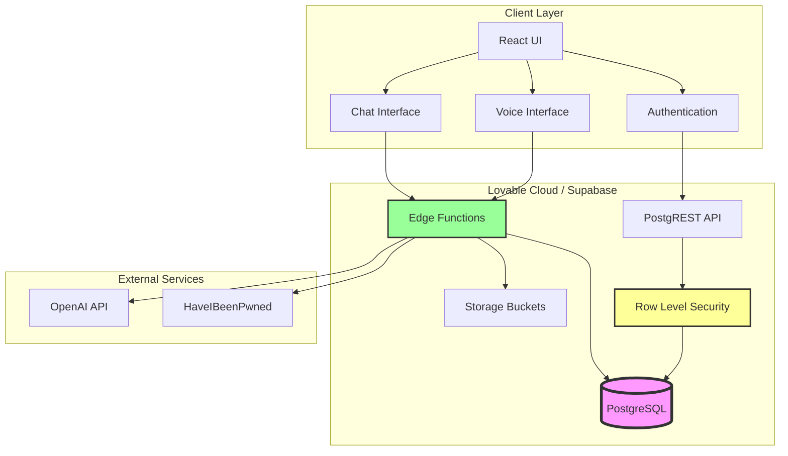
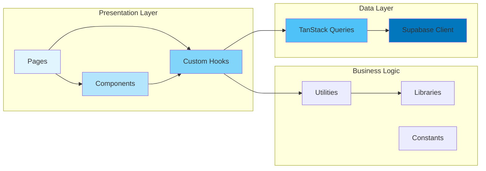
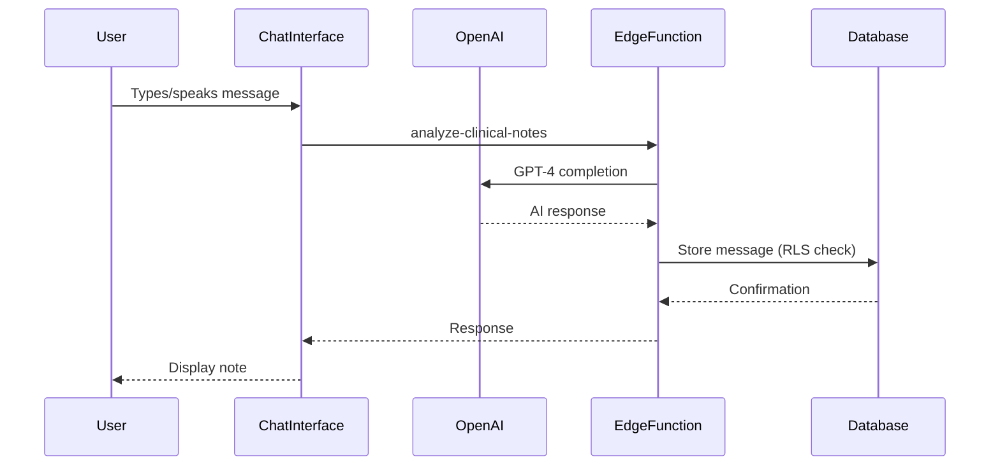
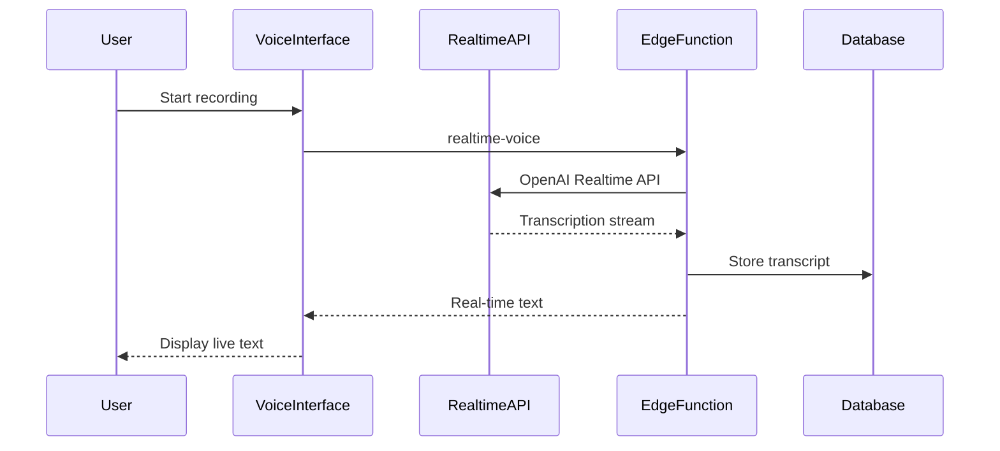
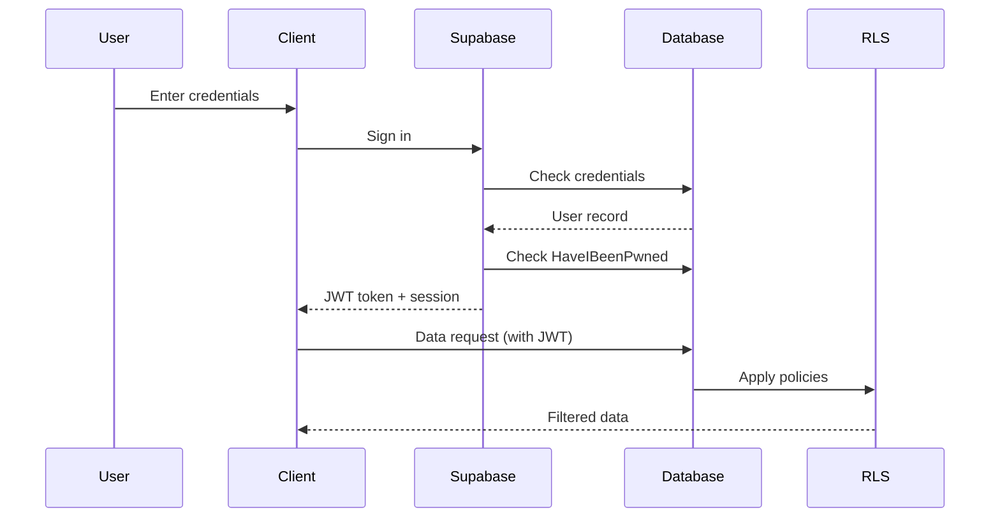
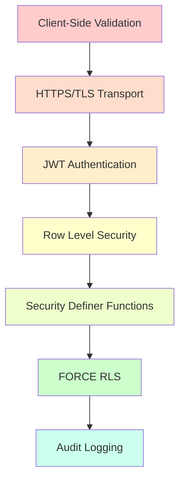
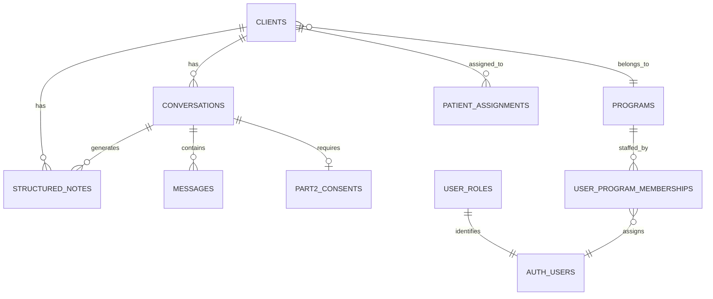
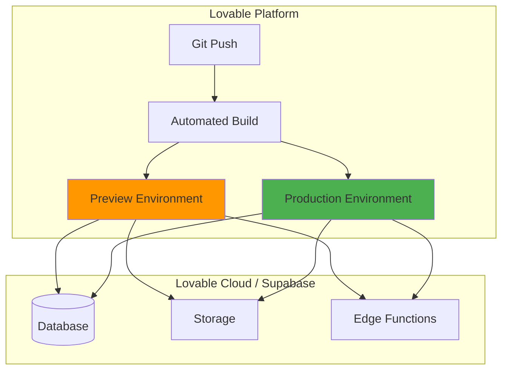

# Mental Scribe Architecture

## System Overview

Mental Scribe is a HIPAA-compliant, browser-based clinical documentation platform built on a modern serverless architecture.



## Technology Stack

### Frontend
- **React 18.3** - UI framework
- **TypeScript** - Type safety
- **Vite** - Build tool and dev server
- **React Router 6** - Client-side routing
- **TanStack Query** - Data fetching and caching
- **Tailwind CSS** - Styling framework
- **Shadcn/ui** - Component library

### Backend (Lovable Cloud / Supabase)
- **PostgreSQL** - Primary database
- **PostgREST** - Automatic REST API
- **Row Level Security (RLS)** - Data access control
- **Edge Functions (Deno)** - Serverless compute
- **Supabase Storage** - File storage with signed URLs

### External APIs
- **OpenAI GPT-4** - AI-powered note generation
- **OpenAI Whisper** - Voice transcription
- **HaveIBeenPwned API** - Password breach detection

### Development & Testing
- **Vitest** - Unit testing framework
- **React Testing Library** - Component testing
- **ESLint** - Code linting
- **TypeScript Compiler** - Type checking

## Application Architecture



## Directory Structure

```
mental-scribe-app/
├── src/
│   ├── components/          # React components
│   │   ├── ui/             # Shadcn/ui base components
│   │   ├── clients/        # Client management components
│   │   ├── ChatInterface.tsx
│   │   ├── VoiceInterface.tsx
│   │   └── ...
│   ├── pages/              # Route pages
│   │   ├── Index.tsx
│   │   ├── Auth.tsx
│   │   ├── Clients.tsx
│   │   └── ...
│   ├── hooks/              # Custom React hooks
│   │   ├── useConversations.ts
│   │   ├── useMessages.ts
│   │   └── ...
│   ├── lib/                # Business logic libraries
│   │   ├── openai.ts       # OpenAI integration
│   │   ├── fhir.ts         # FHIR export
│   │   └── ...
│   ├── integrations/       # External integrations
│   │   └── supabase/       # Supabase client & types
│   ├── constants/          # Application constants
│   └── utils/              # Utility functions
├── supabase/
│   ├── functions/          # Edge functions
│   │   ├── analyze-clinical-notes/
│   │   ├── secure-signup/
│   │   ├── disclose/
│   │   └── realtime-voice/
│   ├── migrations/         # Database migrations
│   └── config.toml         # Supabase configuration
└── docs/                   # Documentation
```

## Data Flow Patterns

### 1. Clinical Note Creation Flow



### 2. Voice Transcription Flow



### 3. Authentication & Authorization Flow



## Security Architecture

### Defense in Depth Layers



### Row Level Security Model

**Key Principles:**
1. **RESTRICTIVE policies** block anonymous access (absolute denial)
2. **PERMISSIVE policies** grant conditional access (owner, admin, clinical staff)
3. **FORCE ROW LEVEL SECURITY** prevents service role bypass
4. **Security definer functions** prevent RLS recursion

**Policy Hierarchy:**
```
RESTRICTIVE Policies (Absolute Blocks)
├── Anonymous users → BLOCKED
├── Public role → BLOCKED
└── Unauthenticated → BLOCKED

PERMISSIVE Policies (Conditional Grants)
├── Owner access → user_id = auth.uid()
├── Admin access → has_role('admin')
└── Clinical staff → is_clinical_staff() + is_assigned_to_patient()
```

### Data Classification

**Standard PHI (HIPAA Protected):**
- Client demographics
- Session notes
- Clinical documentation

**Part 2 Protected (42 CFR Part 2):**
- Substance use disorder (SUD) treatment records
- Requires explicit consent for disclosure
- Enhanced access controls via `is_part2_protected` flag

## Edge Function Architecture

### Function Responsibilities

| Function | Purpose | Security |
|----------|---------|----------|
| **analyze-clinical-notes** | AI note generation | Authenticated, rate-limited |
| **secure-signup** | User registration | Public, HIBP check, CSP headers |
| **disclose** | Part 2 consent export | Authenticated, consent validation |
| **realtime-voice** | Live transcription | Authenticated, WebSocket |

### Edge Function Pattern

```typescript
// Standard edge function structure
import { createClient } from '@supabase/supabase-js'

const corsHeaders = {
  'Access-Control-Allow-Origin': '*',
  'Access-Control-Allow-Headers': 'authorization, x-client-info, apikey, content-type',
  'Content-Security-Policy': "default-src 'self'; script-src 'none';"
}

Deno.serve(async (req) => {
  // CORS preflight
  if (req.method === 'OPTIONS') {
    return new Response(null, { headers: corsHeaders })
  }

  try {
    // Initialize Supabase client with auth
    const supabase = createClient(
      Deno.env.get('SUPABASE_URL')!,
      Deno.env.get('SUPABASE_SERVICE_ROLE_KEY')!
    )

    // Business logic
    // ...

    return new Response(JSON.stringify(result), {
      headers: { ...corsHeaders, 'Content-Type': 'application/json' },
    })
  } catch (error) {
    return new Response(JSON.stringify({ error: error.message }), {
      status: 500,
      headers: { ...corsHeaders, 'Content-Type': 'application/json' },
    })
  }
})
```

## Database Schema Overview

### Core Tables

**Users & Roles:**
- `user_roles` - Application roles (admin, user)
- `user_sessions` - Active sessions
- `mfa_recovery_codes` - MFA backup codes
- `failed_login_attempts` - Account lockout tracking

**Clinical Data:**
- `clients` - Patient demographics and treatment info
- `conversations` - Session threads
- `messages` - Individual session messages
- `structured_notes` - Formatted clinical notes
- `recordings` - Audio file metadata
- `uploaded_files` - Document attachments

**Programs & Access:**
- `programs` - Treatment programs (Part 2 flag)
- `user_program_memberships` - Staff assignments
- `patient_assignments` - Staff-patient relationships
- `patient_identity_links` - External ID mapping

**Compliance:**
- `part2_consents` - SUD disclosure consents
- `disclosure_consents` - Export authorizations
- `audit_logs` - Immutable access logs
- `compliance_reports` - Regulatory reports

### Key Relationships



## Deployment Architecture



**Deployment Pipeline:**
1. Code pushed to Lovable Git
2. Automated build runs (Vite, TypeScript, tests)
3. Preview deployed automatically
4. Manual promotion to production
5. Edge functions auto-deploy with migrations

## Performance Considerations

### Data Fetching Strategy

**TanStack Query Configuration:**
```typescript
{
  staleTime: 5 * 60 * 1000,     // 5 minutes
  cacheTime: 10 * 60 * 1000,    // 10 minutes
  refetchOnWindowFocus: true,    // Keep data fresh
  retry: 3                       // Retry failed requests
}
```

**Optimization Techniques:**
- Optimistic updates for UI responsiveness
- Debounced search inputs (300ms)
- Pagination for large lists (conversations, clients)
- Lazy loading for heavy components
- Session storage for drafts (XSS-safe)

### Database Optimization

**Indexes:**
- `clients.user_id` - Owner access
- `conversations.user_id` - Owner access
- `messages.conversation_id` - Message lookup
- `audit_logs.created_at` - Time-based queries
- `part2_consents.conversation_id` - Consent checks

**Query Patterns:**
- Use `.select()` to limit columns
- Use `.single()` for single-row expectations
- Use `.order()` for sorted results
- Avoid N+1 queries with `.select('*, programs(*))`

## Monitoring & Observability

### Audit Logging

All sensitive operations are logged to `audit_logs`:
- User authentication events
- Part 2 consent grants/revocations
- Data access (especially Part 2 data)
- Admin actions
- Rate limit violations

**Log Sanitization:**
Sensitive fields (passwords, tokens, API keys) are stripped via `sanitize_audit_metadata()` function.

### Edge Function Logging

```typescript
console.log('[INFO] Function started', { timestamp: new Date().toISOString() })
console.error('[ERROR] Operation failed', { error: error.message, userId })
```

Logs available in Lovable Cloud dashboard under edge function metrics.

## Compliance Features

### HIPAA (45 CFR § 164.312)

✅ **Access Control** - RLS, JWT auth, MFA support  
✅ **Audit Controls** - Immutable audit logs  
✅ **Integrity** - User ID immutability, RLS enforcement  
✅ **Authentication** - JWT with session management

### 42 CFR Part 2 (SUD Treatment)

✅ **Consent Required** - `part2_consents` table tracks authorizations  
✅ **Re-disclosure Prohibition** - Clinical staff have SELECT-only access  
✅ **Notice Requirement** - `disclose` edge function validates consent  
✅ **Program Isolation** - Staff can only access assigned programs

## Development Workflow

### Local Development

```bash
# Install dependencies
npm install

# Start dev server
npm run dev

# Run tests
npm test

# Type check
npm run type-check

# Lint
npm run lint
```

### Testing Strategy

**Unit Tests:**
- Utility functions
- Business logic
- Constants and configurations

**Component Tests:**
- User interactions
- Error boundaries
- Form validation

**Integration Tests:**
- Authentication flows
- Data fetching
- Edge function calls

### Migration Workflow

1. Create migration file: `supabase/migrations/YYYYMMDD_description.sql`
2. Test migration locally via Lovable Cloud
3. Migration auto-deploys with next build
4. Run security linter: `supabase db lint`
5. Verify RLS policies still enforced

## Future Architecture Considerations

**Potential Enhancements:**
- Offline support via Service Workers
- Real-time collaboration with Supabase Realtime
- Multi-tenant architecture (organizations)
- Export to EHR systems (HL7 FHIR)
- Advanced analytics dashboard
- Mobile app (React Native)

---

**Last Updated:** October 6, 2025  
**Architecture Version:** 1.0  
**Next Review:** January 6, 2026
