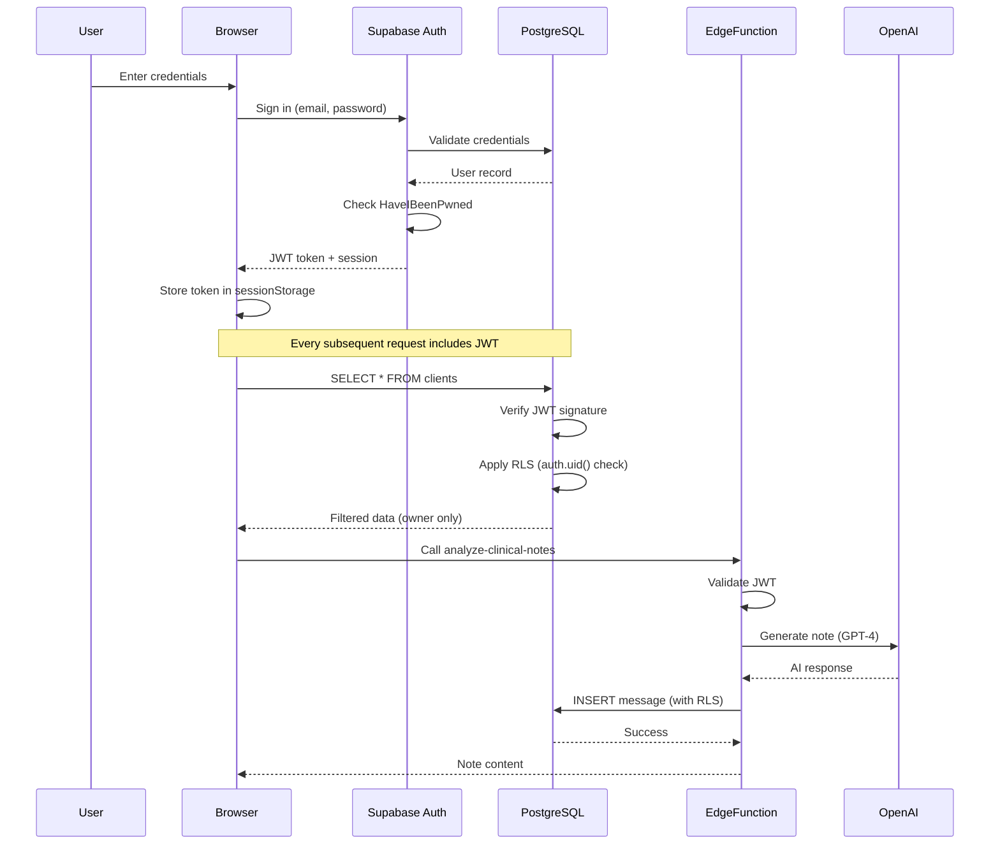
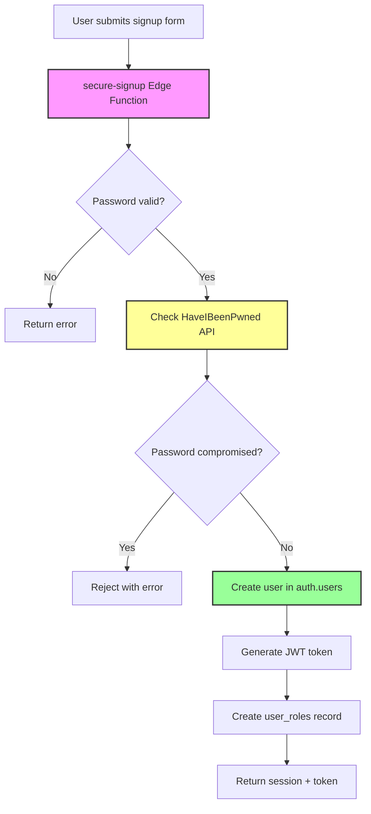
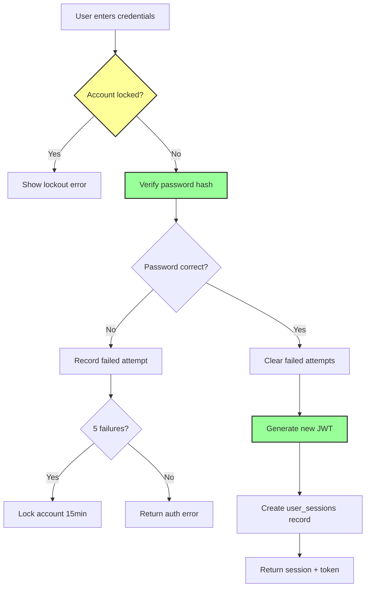
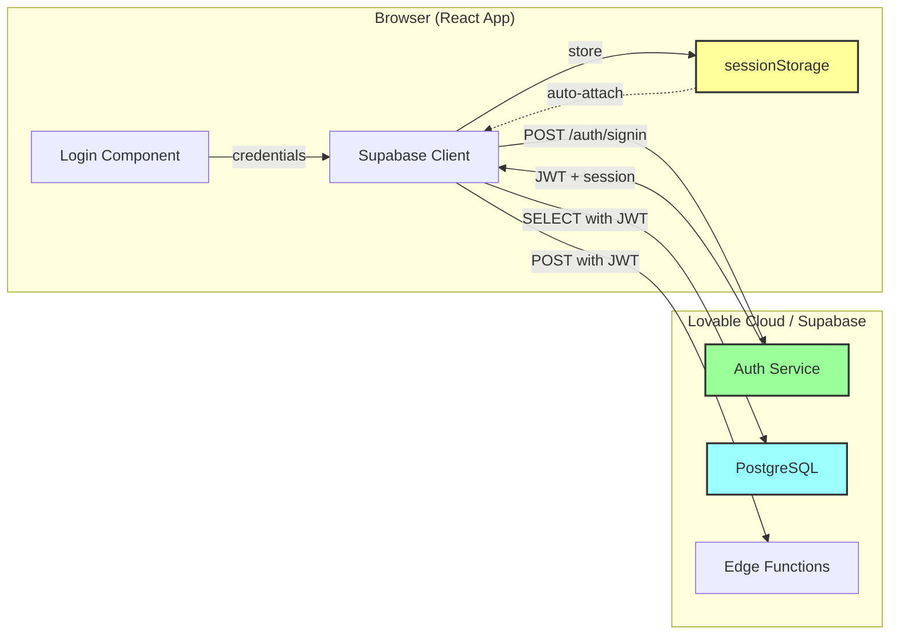
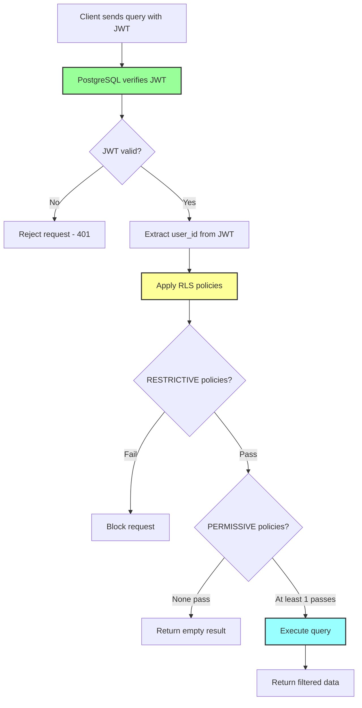
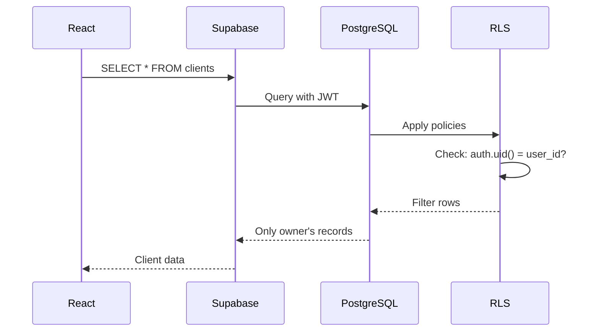
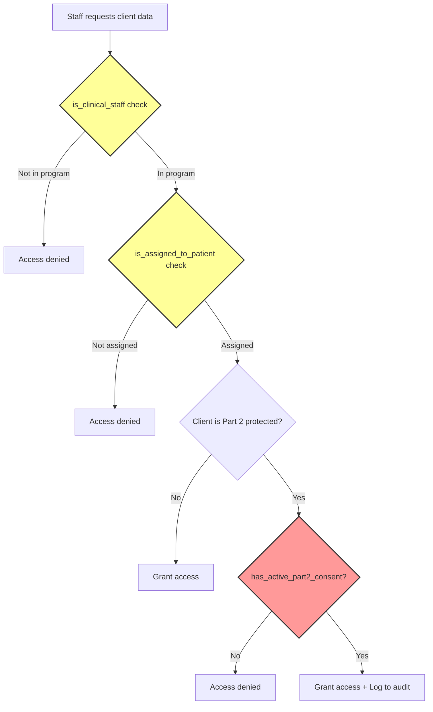
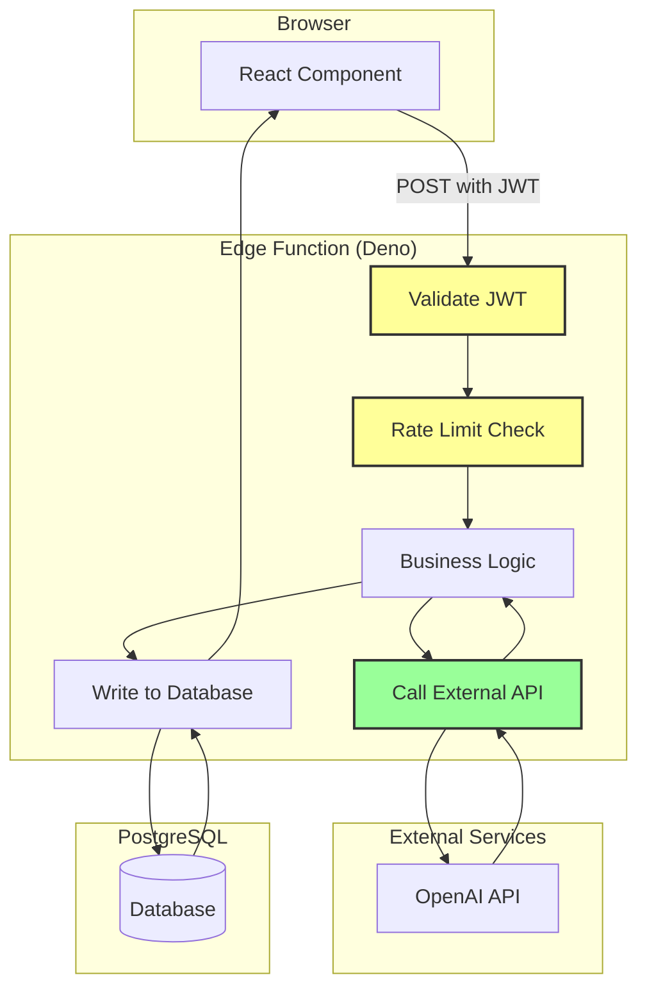
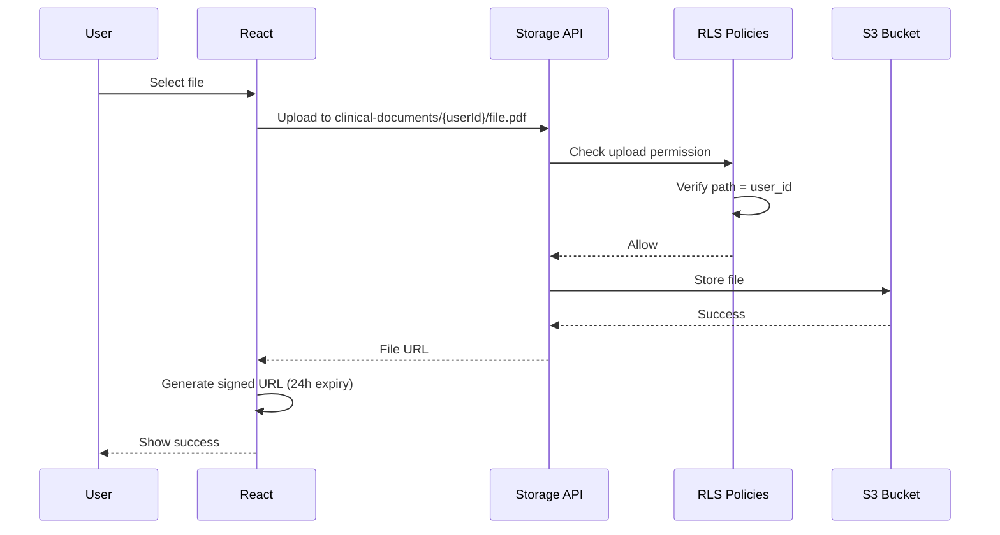
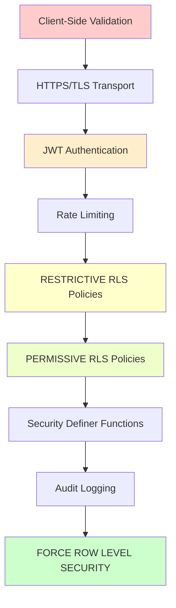

# Authentication & Data Flow Architecture

This document explains how authentication, tokens, and data flow through Mental Scribe's security architecture.

---

## System Flow Overview



---

## Authentication Flow (Detailed)

### 1. Sign Up Process



**Key Security Measures:**

1. **Server-side password validation**
   - Minimum 8 characters
   - Checked against HaveIBeenPwned database (k-anonymity)
   - Fails closed on network errors (safe default)

2. **Account lockout protection**
   - 5 failed attempts → 15-minute lockout
   - Tracked in `failed_login_attempts` table
   - Cleared on successful login

3. **JWT token generation**
   - Signed by Supabase Auth
   - Contains: user_id, email, role, exp (expiration)
   - Expires after 1 hour (refresh token lasts 30 days)

### 2. Sign In Process



**Session Management:**

- **Session token** stored in `sessionStorage` (XSS-safe, cleared on tab close)
- **Refresh token** stored in secure HTTP-only cookie (managed by Supabase)
- **Session expiry:** 30 minutes of inactivity
- **Auto-refresh:** Supabase client auto-refreshes tokens before expiry

---

## Token Flow Through the System

### JWT Token Structure

```json
{
  "sub": "user-uuid-here",              // User ID
  "email": "doctor@example.com",
  "role": "authenticated",
  "aal": "aal1",                        // Authentication Assurance Level
  "exp": 1699564800,                    // Expiration timestamp
  "iat": 1699561200,                    // Issued at timestamp
  "session_id": "session-uuid"
}
```

**Token Lifecycle:**

1. **Issued:** On successful authentication
2. **Stored:** In sessionStorage (client) + HTTP-only cookie (refresh)
3. **Included:** In Authorization header for every request
4. **Verified:** By PostgreSQL RLS and Edge Functions
5. **Refreshed:** Automatically before expiration
6. **Revoked:** On sign out or session expiry

### How Tokens Move



**Token Attachment (Automatic):**

```typescript
// Supabase client automatically includes token
const { data, error } = await supabase
  .from('clients')
  .select('*')
// ↑ JWT automatically added to Authorization header

// Edge function calls also include token
const { data, error } = await supabase.functions.invoke('analyze-clinical-notes', {
  body: { messages }
})
// ↑ JWT automatically passed to edge function
```

---

## Row Level Security (RLS) Enforcement

### Why RLS Matters

**Without RLS:**
```sql
-- ANY authenticated user could do this:
SELECT * FROM clients;
-- Result: ALL client records (HIPAA violation!)
```

**With RLS:**
```sql
-- Same query, but RLS filters automatically:
SELECT * FROM clients;
-- Result: ONLY records where user_id = auth.uid()
```

**RLS is PostgreSQL's built-in security layer that:**
1. ✅ Filters rows **at the database level** (cannot be bypassed)
2. ✅ Uses JWT to identify the requesting user (`auth.uid()`)
3. ✅ Enforces policies **before** returning data
4. ✅ Works for SELECT, INSERT, UPDATE, DELETE operations

### RLS Policy Evaluation Flow



**Mental Scribe RLS Model:**

```sql
-- RESTRICTIVE: Absolute block for anonymous users
CREATE POLICY "clients_block_anon_all"
ON public.clients
AS RESTRICTIVE
FOR ALL
TO public, anon
USING (false)
WITH CHECK (false);

-- PERMISSIVE: Allow owners to see own data
CREATE POLICY "clients_owner_select"
ON public.clients
FOR SELECT
USING (auth.uid() = user_id);

-- PERMISSIVE: Allow admins to see all data
CREATE POLICY "clients_admin_select"
ON public.clients
FOR SELECT
USING (has_role(auth.uid(), 'admin'));

-- PERMISSIVE: Allow clinical staff to see assigned patients
CREATE POLICY "clients_clinical_staff_select"
ON public.clients
FOR SELECT
USING (
  program_id IS NOT NULL
  AND is_clinical_staff(auth.uid(), program_id)
  AND is_assigned_to_patient(auth.uid(), id)
);
```

**Evaluation Logic:**

1. **RESTRICTIVE policies** evaluated first (ALL must pass)
   - If ANY RESTRICTIVE fails → **Request blocked**
   - Anonymous users always fail → **Data protected**

2. **PERMISSIVE policies** evaluated second (ANY can pass)
   - Owner policy: User sees own records
   - Admin policy: Admin sees all records
   - Staff policy: Staff sees assigned patients only

3. **Final result:** Intersection of all passing policies
   - A user can be owner AND admin → sees all
   - A staff member sees only assigned patients in assigned programs

---

## Data Access Patterns

### Pattern 1: Owner Access (Most Common)



**Example:**
```typescript
// User: doctor@example.com (UUID: abc-123)
const { data } = await supabase.from('clients').select('*')

// PostgreSQL executes:
// SELECT * FROM clients WHERE user_id = 'abc-123'
// Due to RLS policy: USING (auth.uid() = user_id)

// Result: Only clients created by doctor@example.com
```

### Pattern 2: Admin Access

```mermaid
sequenceDiagram
    participant Admin
    participant Supabase
    participant PostgreSQL
    participant has_role()

    Admin->>Supabase: SELECT * FROM clients
    Supabase->>PostgreSQL: Query with JWT
    PostgreSQL->>has_role(): Check if admin
    has_role()->>PostgreSQL: has_role('abc-123', 'admin') → TRUE
    PostgreSQL-->>Supabase: All records
    Supabase-->>Admin: All client data
```

**Example:**
```sql
-- has_role() is a SECURITY DEFINER function
CREATE FUNCTION has_role(_user_id uuid, _role app_role)
RETURNS boolean
SECURITY DEFINER  -- Runs with elevated privileges to bypass RLS
SET search_path = public
AS $$
  SELECT EXISTS (
    SELECT 1 FROM user_roles
    WHERE user_id = _user_id AND role = _role
  )
$$;

-- Used in RLS policy:
CREATE POLICY "clients_admin_select"
ON clients FOR SELECT
USING (has_role(auth.uid(), 'admin'));
```

### Pattern 3: Clinical Staff Access (Part 2 Compliant)



**Example:**
```sql
-- Clinical staff can ONLY see clients where:
-- 1. Staff is member of the program
-- 2. Staff is assigned to the specific patient
-- 3. If Part 2 data, active consent exists

CREATE POLICY "clients_clinical_staff_select"
ON clients FOR SELECT
USING (
  program_id IS NOT NULL
  AND is_clinical_staff(auth.uid(), program_id)      -- Check #1
  AND is_assigned_to_patient(auth.uid(), id)          -- Check #2
  -- Check #3 handled by separate Part 2 policies
);
```

---

## Edge Function Data Flow

### Edge Function Architecture



### Example: analyze-clinical-notes Function

**Step-by-step flow:**

1. **React calls edge function**
   ```typescript
   const { data, error } = await supabase.functions.invoke('analyze-clinical-notes', {
     body: {
       messages: [{ role: 'user', content: 'Patient reports anxiety' }],
       conversationId: 'uuid-here'
     }
   })
   ```

2. **Edge function validates JWT**
   ```typescript
   const authHeader = req.headers.get('Authorization')
   if (!authHeader) return new Response('Unauthorized', { status: 401 })
   
   const supabase = createClient(supabaseUrl, supabaseAnonKey, {
     global: { headers: { Authorization: authHeader } }
   })
   
   const { data: { user }, error } = await supabase.auth.getUser()
   if (error || !user) return new Response('Unauthorized', { status: 401 })
   ```

3. **Check rate limit**
   ```typescript
   const allowed = await supabase.rpc('check_rate_limit', {
     _user_id: user.id,
     _endpoint: 'analyze-clinical-notes',
     _max_requests: 100,
     _window_minutes: 60
   })
   
   if (!allowed) return new Response('Rate limit exceeded', { status: 429 })
   ```

4. **Call OpenAI API**
   ```typescript
   const response = await openai.chat.completions.create({
     model: 'gpt-4',
     messages: body.messages
   })
   ```

5. **Store result in database (with RLS)**
   ```typescript
   const { error } = await supabase.from('messages').insert({
     conversation_id: body.conversationId,
     role: 'assistant',
     content: response.choices[0].message.content
   })
   // ↑ RLS ensures message is linked to correct user's conversation
   ```

6. **Return to client**
   ```typescript
   return new Response(JSON.stringify({ content: aiResponse }), {
     headers: { 'Content-Type': 'application/json' }
   })
   ```

---

## Storage Access Flow

### Secure File Upload



**Storage RLS Policy:**

```sql
-- Users can only upload to their own folder
CREATE POLICY "Users can upload own files"
ON storage.objects FOR INSERT
WITH CHECK (
  bucket_id = 'clinical-documents'
  AND auth.uid()::text = (storage.foldername(name))[1]
);

-- Users can only access files in their own folder
CREATE POLICY "Users can read own files"
ON storage.objects FOR SELECT
USING (
  bucket_id = 'clinical-documents'
  AND auth.uid()::text = (storage.foldername(name))[1]
);
```

**Signed URLs (Temporary Access):**

```typescript
// Generate signed URL (expires in 24 hours)
const { data, error } = await supabase.storage
  .from('clinical-documents')
  .createSignedUrl(`${userId}/report.pdf`, 86400) // 24 hours

// URL format:
// https://bmtzgeffbzmcwmnprxmx.supabase.co/storage/v1/object/sign/
// clinical-documents/user-id/file.pdf?token=eyJhbGci...
```

**Why Signed URLs?**
- ✅ Temporary access (expires after set time)
- ✅ No need to store files publicly
- ✅ Cannot be guessed or brute-forced
- ✅ Revocable (delete file = URL invalidated)

---

## Security Layers Summary

Mental Scribe uses **Defense in Depth** - multiple security layers:



**Layer Breakdown:**

| Layer | Purpose | Bypassed If |
|-------|---------|-------------|
| **Client validation** | UX improvement | ❌ Can be bypassed (not security) |
| **HTTPS/TLS** | Encrypt traffic | ❌ MITM attack (very difficult) |
| **JWT Auth** | Identify user | ❌ Stolen token (short expiry mitigates) |
| **Rate limiting** | Prevent abuse | ❌ Distributed attack (IP-based) |
| **RESTRICTIVE RLS** | Absolute blocks | ✅ **Cannot be bypassed** |
| **PERMISSIVE RLS** | Conditional access | ✅ **Cannot be bypassed** |
| **Security definer** | Avoid RLS recursion | ⚠️ If function logic flawed |
| **Audit logs** | Track access | N/A (detection, not prevention) |
| **FORCE RLS** | Block service role | ✅ **Cannot be bypassed** |

**Critical Insight:**

Even if an attacker:
- ✅ Steals a JWT token
- ✅ Bypasses rate limiting
- ✅ Finds SQL injection vulnerability (none exist)

**They STILL cannot:**
- ❌ Access other users' data (RLS blocks at database level)
- ❌ Disable RLS (FORCE RLS prevents this)
- ❌ Bypass RESTRICTIVE policies (absolute denial)

**RLS is the last line of defense and the most critical security layer.**

---

## Troubleshooting Common Issues

### Issue 1: "Row level security policy violation"

**Symptom:** Query fails with RLS error

**Causes:**
1. User not authenticated (JWT missing/expired)
2. RLS policy doesn't allow operation
3. `user_id` field not set correctly on INSERT

**Debug:**
```sql
-- Check current user
SELECT auth.uid();

-- Check if RLS allows access
SELECT * FROM clients WHERE user_id = auth.uid();

-- Check policies
SELECT * FROM pg_policies WHERE tablename = 'clients';
```

**Fix:**
```typescript
// Ensure user is logged in
const { data: { user } } = await supabase.auth.getUser()
if (!user) {
  // Redirect to login
}

// Ensure user_id is set on INSERT
const { error } = await supabase.from('clients').insert({
  first_name: 'John',
  last_name: 'Doe',
  user_id: user.id  // ← CRITICAL
})
```

### Issue 2: "JWT expired"

**Symptom:** Requests fail with 401 after inactivity

**Cause:** Session expired (default: 1 hour)

**Fix:**
```typescript
// Supabase auto-refreshes tokens
// Force manual refresh:
const { data, error } = await supabase.auth.refreshSession()

// Or sign in again
await supabase.auth.signInWithPassword({ email, password })
```

### Issue 3: Edge function can't access database

**Symptom:** Edge function INSERT/UPDATE fails

**Cause:** RLS policy blocks service role

**Fix:**
```typescript
// Create Supabase client with user's JWT
const supabase = createClient(url, key, {
  global: {
    headers: { Authorization: req.headers.get('Authorization') }
  }
})

// Now queries run as the authenticated user, not service role
```

---

## Best Practices

### ✅ DO

- **Store tokens in sessionStorage** (not localStorage - XSS risk)
- **Use RESTRICTIVE policies** for absolute blocks
- **Log all PHI access** to audit_logs
- **Validate JWT in edge functions** before processing
- **Use signed URLs** for file access (not public buckets)
- **Test RLS policies** with different user roles
- **Monitor failed login attempts** for brute force attacks

### ❌ DON'T

- **Never bypass RLS** with service role in client code
- **Never store sensitive data** in JWT payload
- **Never disable RLS** on PHI tables
- **Never trust client-side validation** alone
- **Never hardcode credentials** in code
- **Never log sensitive data** to console (PHI leakage)
- **Never use default secrets** in production

---

**Document Version:** 1.0  
**Last Updated:** October 6, 2025  
**Next Review:** January 6, 2026  
**Maintained By:** Mental Scribe Security Team
