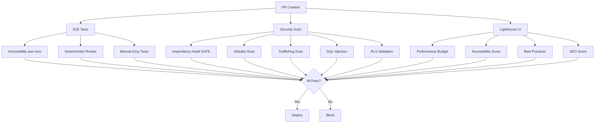

# CI/CD Pipeline Enhancements

This document details the security and quality gates added to the CI/CD pipeline.

## Overview

The enhanced pipeline includes:
- ✅ Automated accessibility testing with axe-core
- ✅ Performance budgets with Lighthouse CI
- ✅ Deterministic route testing
- ✅ Deep secret scanning with gitleaks
- ✅ Hardened dependency auditing

## 1. Accessibility Testing (axe-core)

**Purpose**: Catch WCAG 2.0/2.1 A/AA violations at crawl time

**Implementation**: `test/e2e/accessibility-axe.spec.ts`

**Manual Setup Required** (after project export):
```bash
npm install --save-dev axe-core @axe-core/playwright
```

**Coverage**:
- WCAG 2.1 Level A/AA compliance
- Color contrast validation
- Image alt text verification
- Form label validation
- HTML structure validation
- Keyboard accessibility
- ARIA attribute validation

**CI Integration**: Runs automatically in e2e-tests.yml workflow

## 2. Performance Testing (Lighthouse CI)

**Purpose**: Enforce performance budgets and catch regressions

**Implementation**: `.github/workflows/lighthouse-ci.yml` + `lighthouserc.json`

**Budgets**:
- Performance: ≥75
- Accessibility: ≥90
- Best Practices: ≥85
- SEO: ≥85

**Metrics Tracked**:
- First Contentful Paint: <2s
- Largest Contentful Paint: <2.5s
- Cumulative Layout Shift: <0.1
- Total Blocking Time: <300ms
- Speed Index: <3s

**CI Integration**: Runs on PR and push to main/develop

**Artifacts**: Results stored in `.lighthouseci/` for 30 days

## 3. Deterministic Route Testing

**Purpose**: Ensure consistent test coverage across all routes

**Implementation**: 
- `test/routes.json` - Single source of truth for routes
- `test/e2e/deterministic-routes.spec.ts` - Route-based tests

**Route Schema**:
```json
{
  "url": "/path",
  "name": "Display Name",
  "priority": "critical|high|medium|low",
  "authenticated": true|false,
  "role": "admin" (optional)
}
```

**Benefits**:
- No missed routes
- Consistent test coverage
- Easy to maintain
- Priority-based testing

**Usage**: Update `test/routes.json` when adding new routes

## 4. Deep Secret Scanning (gitleaks)

**Purpose**: Detect hardcoded secrets, API keys, tokens, and credentials

**Implementation**: 
- `.github/workflows/security-scan.yml` (gitleaks action)
- `.gitleaks.toml` (custom rules)

**Custom Rules**:
- Supabase service role keys
- Supabase anon keys in source code
- OpenAI API keys (sk-*)
- Anthropic API keys (sk-ant-*)
- Generic API keys/secrets
- JWT tokens in source
- AWS access keys
- Private keys (RSA/EC/DSA)

**Allowlist**:
- Documentation files (*.md)
- Example files (*.example)
- Test files (*test.*, *.spec.*)
- CHANGELOG.md
- .env.example

**CI Integration**: Runs alongside TruffleHog for comprehensive coverage

## 5. Hardened Dependency Auditing

**Purpose**: Block deployments with high/critical vulnerabilities

**Implementation**: `.github/workflows/security-scan.yml`

**Gating Rules**:
- **BLOCK**: Any critical vulnerabilities (exit 1)
- **BLOCK**: More than 5 high vulnerabilities (exit 1)
- **WARN**: Moderate vulnerabilities (continue)

**Changes from Previous**:
- ❌ Before: `npm audit --audit-level=moderate` + `continue-on-error: true`
- ✅ After: `pnpm audit --audit-level=high` + hard fail on critical/high

**Bypass** (for false positives):
```bash
# In .github/workflows/security-scan.yml, adjust threshold:
if [ "$HIGH_COUNT" -gt 10 ]; then  # was 5
```

## CI/CD Workflow Overview



## Setup Instructions

### 1. Install Dependencies (post-export)

```bash
# Accessibility testing
npm install --save-dev axe-core @axe-core/playwright

# Lighthouse CI
npm install -g @lhci/cli
```

### 2. Update Route List

Edit `test/routes.json` when adding new routes:

```json
{
  "url": "/new-route",
  "name": "New Feature",
  "priority": "high",
  "authenticated": true
}
```

### 3. Configure Secrets (if needed)

For Snyk (optional):
```bash
gh secret set SNYK_TOKEN --body "your-snyk-token"
```

For Gitleaks license (organizations only):
```bash
gh secret set GITLEAKS_LICENSE --body "your-license-key"
```

### 4. Adjust Performance Budgets

Edit `lighthouserc.json`:

```json
{
  "ci": {
    "assert": {
      "assertions": {
        "categories:performance": ["error", {"minScore": 0.75}],
        "first-contentful-paint": ["warn", {"maxNumericValue": 2000}]
      }
    }
  }
}
```

## Troubleshooting

### Accessibility Tests Failing

1. Check test results: `test-results/`
2. Review specific violations in Playwright report
3. Common fixes:
   - Add alt text to images
   - Add labels to form inputs
   - Fix color contrast (use design tokens)
   - Add ARIA labels to icon buttons

### Performance Budget Failing

1. Check Lighthouse report: `.lighthouseci/`
2. Common issues:
   - Large bundle size → code splitting
   - Unoptimized images → use WebP, lazy loading
   - Blocking scripts → defer non-critical JS
   - Missing caching → add cache headers

### Dependency Audit Blocking

1. Review audit report: `pnpm audit`
2. Options:
   - Update vulnerable packages: `pnpm update`
   - Apply patches: `pnpm patch <package>`
   - Temporarily increase threshold (not recommended)
   - Document false positives

### Gitleaks False Positives

1. Check `.gitleaks.toml` allowlist
2. Add pattern to allowlist:
```toml
regexes = [
  '''your-safe-pattern-here'''
]
```

3. Or exclude specific paths:
```toml
paths = [
  '''docs/examples/.*'''
]
```

## Maintenance

### Weekly
- Review Lighthouse trends
- Check for new vulnerabilities
- Update route list

### Monthly
- Review gitleaks rules
- Update performance budgets
- Check for new axe-core rules

### Quarterly
- Update dependencies
- Review CI performance
- Adjust thresholds based on data

## References

- [axe-core Rules](https://github.com/dequelabs/axe-core/blob/develop/doc/rule-descriptions.md)
- [Lighthouse Scoring](https://developer.chrome.com/docs/lighthouse/performance/performance-scoring)
- [Gitleaks Configuration](https://github.com/gitleaks/gitleaks#configuration)
- [WCAG 2.1 Guidelines](https://www.w3.org/WAI/WCAG21/quickref/)
