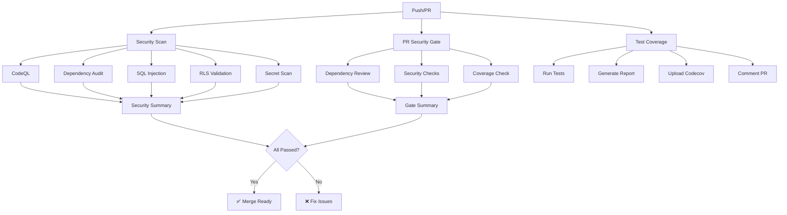

# CI/CD Security Hardening

Comprehensive security scanning and validation for Mental Scribe.

## Workflows

### 1. Security Scanning (`security.yml`)

**Triggers:**
- Push to `main` or `develop`
- Pull requests to `main` or `develop`
- Weekly schedule (Sundays at midnight)
- Manual dispatch

**Jobs:**

#### CodeQL Analysis
- Static code analysis for JavaScript/TypeScript
- Security-extended and quality queries
- Detects: SQL injection, XSS, CSRF, authentication issues
- Results published to Security tab

#### Dependency Audit
- Scans npm dependencies for vulnerabilities
- Fails on critical vulnerabilities
- Warns on >5 high-severity issues
- Uses `pnpm audit` with JSON output

#### SQL Injection Detection
- Scans for dangerous SQL patterns:
  - String concatenation in queries
  - Template literals with user input
  - Dynamic query construction
- Validates parameterized query usage
- Checks Supabase query builder adoption

#### RLS Policy Validation
- Ensures critical tables have RLS enabled:
  - `clients`
  - `user_sessions`
  - `clinical_notes`
  - `patient_consents`
- Validates policy definitions exist
- Counts policies per table

#### Secret Scanning
- Detects exposed secrets:
  - API keys (Supabase, third-party)
  - Service role keys
  - Passwords and tokens
  - Private keys
- Excludes safe files (docs, configs)
- Redacts matches in logs

### 2. PR Security Gate (`pr-security.yml`)

**Triggers:**
- Pull request opened/updated/reopened

**Jobs:**

#### Dependency Review
- Compares dependencies with base branch
- Blocks problematic licenses (GPL, AGPL)
- Fails on moderate+ severity vulnerabilities
- Comments summary on PR

#### PR Security Checks
- Detects changes to critical files
- Finds TODO/FIXME in security code
- Validates environment variable usage
- Checks for console.log statements (data leaks)

#### Test Coverage
- Runs test suite with coverage
- Comments coverage report on PR
- Shows coverage by metric and directory
- Updates existing comment (no spam)

### 3. Test Coverage (`coverage.yml`)

**Triggers:**
- Push to `main` or `develop`
- Pull requests

**Jobs:**

#### Coverage Report
- Generates detailed coverage metrics
- Uploads to Codecov
- Posts formatted comment on PRs
- Color-coded badges (🟢 🟡 🔴)

#### HTML Report (main only)
- Generates HTML coverage report
- Deploys to GitHub Pages
- Accessible at: `https://<user>.github.io/<repo>/coverage/`

## Setup

### Required Secrets

Add these secrets in GitHub Settings → Secrets and variables → Actions:

```
CODECOV_TOKEN=<your-codecov-token>
```

### Optional: Codecov Integration

1. Sign up at [codecov.io](https://codecov.io)
2. Add repository
3. Copy token to GitHub secrets
4. Coverage reports will be uploaded automatically

### Enable GitHub Pages

1. Go to Settings → Pages
2. Source: Deploy from a branch
3. Branch: `gh-pages` → `/root`
4. Save

Coverage reports will be available at:
```
https://<username>.github.io/<repo>/coverage/
```

## Coverage Thresholds

| Metric | Minimum | Target |
|--------|---------|--------|
| Lines | 60% | 80%+ |
| Statements | 60% | 80%+ |
| Functions | 50% | 75%+ |
| Branches | 50% | 70%+ |

### Color Coding
- 🟢 **Green**: ≥80% (Excellent)
- 🟡 **Yellow**: 60-79% (Good)
- 🔴 **Red**: <60% (Needs Improvement)

## Security Checks

### SQL Injection Prevention

**Dangerous Patterns:**
```typescript
// ❌ Bad: String concatenation
const query = `SELECT * FROM users WHERE id = ${userId}`;

// ❌ Bad: Template literals with user input
supabase.rpc('raw_sql', { query: `DELETE FROM ${tableName}` });

// ✅ Good: Parameterized queries
const { data } = await supabase
  .from('users')
  .select()
  .eq('id', userId);
```

### RLS Policy Requirements

All tables containing sensitive data **must have**:
1. Row Level Security enabled
2. At least one SELECT policy
3. Appropriate INSERT/UPDATE/DELETE policies
4. Service role bypass for admin operations

**Example:**
```sql
-- Enable RLS
ALTER TABLE clients ENABLE ROW LEVEL SECURITY;

-- SELECT policy
CREATE POLICY "Users can view own profile"
  ON clients FOR SELECT
  USING (auth.uid() = id);

-- INSERT policy
CREATE POLICY "Users can create own profile"
  ON clients FOR INSERT
  WITH CHECK (auth.uid() = id);
```

### Secret Management

**Never commit:**
- API keys
- Service role keys
- Passwords
- Private keys
- Database credentials

**Always use:**
- Environment variables
- GitHub Secrets
- Vault services (for production)

## CI/CD Pipeline Flow



## Troubleshooting

### CodeQL Timeout

If CodeQL times out (>30 minutes):

```yaml
# Increase timeout in security.yml
timeout-minutes: 60  # Default is 30
```

### Dependency Audit False Positives

Suppress specific vulnerabilities:

```json
// .npmrc or package.json
{
  "pnpm": {
    "auditConfig": {
      "ignoreAdvisories": ["GHSA-xxxx-yyyy-zzzz"]
    }
  }
}
```

### Coverage Upload Fails

Check Codecov token:

```bash
# Test token locally
curl -X POST --data-binary @coverage/coverage-final.json \
  -H "Authorization: Bearer $CODECOV_TOKEN" \
  https://codecov.io/upload/v4
```

## Best Practices

### Pre-Commit Checks

Run security checks locally before pushing:

```bash
# Install dependencies
pnpm install

# Run tests with coverage
pnpm test -- --coverage

# Check dependencies
pnpm audit

# Lint code
pnpm lint

# Type check
pnpm type-check
```

### Security Review Checklist

Before merging PRs:

- [ ] No hardcoded secrets
- [ ] RLS policies on new tables
- [ ] Parameterized queries only
- [ ] No console.log with sensitive data
- [ ] Tests cover security-critical code
- [ ] Dependencies audited
- [ ] CodeQL findings addressed

## Badges

Add to README.md:

```markdown
[](https://github.com/<user>/<repo>/actions/workflows/security.yml)
[](https://codecov.io/gh/<user>/<repo>)
```

## Resources

- [CodeQL Documentation](https://codeql.github.com/docs/)
- [GitHub Security Features](https://docs.github.com/en/code-security)
- [OWASP Top 10](https://owasp.org/www-project-top-ten/)
- [Codecov Documentation](https://docs.codecov.com/)

## Maintenance

### Weekly Tasks
- Review security scan results
- Update dependencies with vulnerabilities
- Check coverage trends

### Monthly Tasks
- Review and update security policies
- Audit access controls
- Test incident response procedures

### Quarterly Tasks
- External security audit
- Penetration testing
- Compliance review (HIPAA)

## License

MIT
