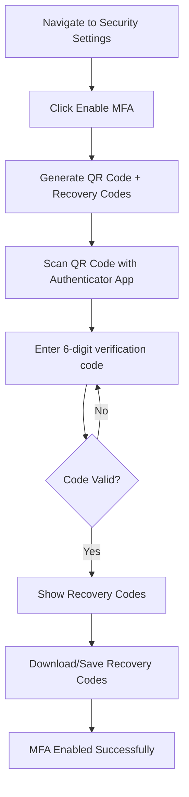
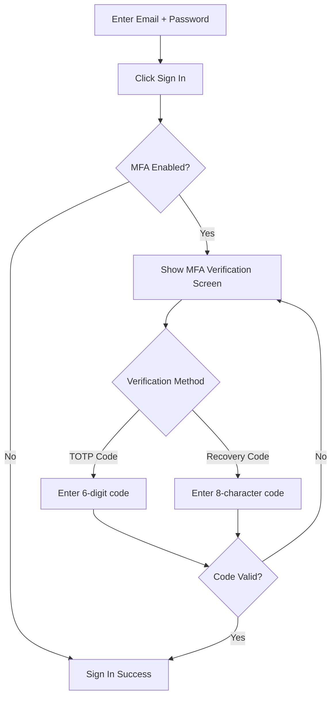
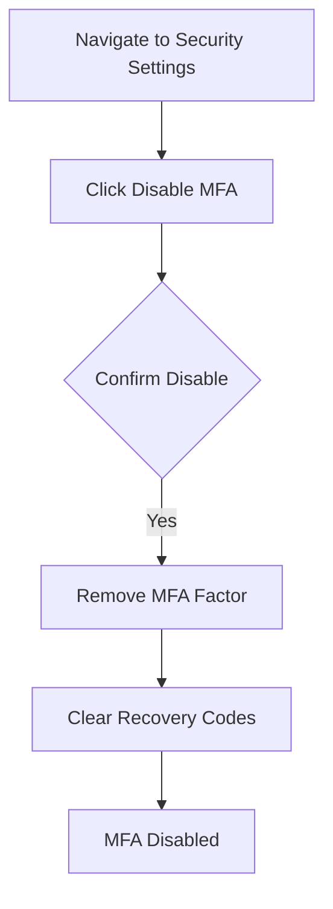

# Multi-Factor Authentication (MFA) Implementation

## Overview

This document describes the complete MFA implementation for the ClinicalAI Assistant application, including enrollment, verification, and recovery code management.

## Features

### ✅ Implemented Features

1. **TOTP-based MFA Enrollment**
   - QR code generation for easy authenticator app setup
   - Manual secret key entry option
   - Support for standard authenticator apps (Google Authenticator, Authy, 1Password, etc.)

2. **Recovery Codes**
   - 10 unique recovery codes generated during enrollment
   - 8-character alphanumeric format (e.g., `ABCD1234`)
   - One-time use per code
   - Downloadable as text file for secure storage
   - Stored with secure hashing (salt + SHA-256)

3. **Verification Flow**
   - Standard 6-digit TOTP code verification
   - Alternative recovery code verification
   - Easy toggle between verification methods
   - User-friendly error messages
   - Input validation and format enforcement

4. **Security Features**
   - Secure storage using `sessionStorage` (cleared on tab close)
   - Recovery codes hashed before database storage
   - RLS policies enforce user-only access
   - Failed login tracking and account lockout integration
   - Audit logging for all MFA operations

## User Flows

### 1. MFA Enrollment



**Steps:**
1. Navigate to `/settings/security`
2. Click "Enable MFA" button
3. Scan QR code with authenticator app (or enter secret key manually)
4. Enter 6-digit verification code from app
5. Save the 10 recovery codes shown
6. Click "I've Saved My Codes" to complete enrollment

### 2. Sign In with MFA



**Steps:**
1. Enter email and password on `/auth` page
2. If MFA is enabled, you'll see the verification screen
3. **Option A: Use Authenticator App**
   - Enter the current 6-digit code from your authenticator app
   - Click "Verify Code"
4. **Option B: Use Recovery Code**
   - Click "Use recovery code instead"
   - Enter one of your 8-character recovery codes
   - Click "Verify Recovery Code"
   - **Note:** Each recovery code can only be used once

### 3. MFA Unenrollment



**Steps:**
1. Navigate to `/settings/security`
2. Click "Disable MFA" button
3. MFA will be disabled and recovery codes invalidated

## Technical Implementation

### Database Schema

```sql
-- MFA Recovery Codes Table
CREATE TABLE public.mfa_recovery_codes (
  id UUID PRIMARY KEY DEFAULT gen_random_uuid(),
  user_id UUID NOT NULL REFERENCES auth.users(id) ON DELETE CASCADE,
  code_hash TEXT NOT NULL,
  salt TEXT,
  used_at TIMESTAMPTZ,
  created_at TIMESTAMPTZ DEFAULT now(),
  CONSTRAINT unique_user_code UNIQUE(user_id, code_hash)
);

-- RLS Policies
ALTER TABLE public.mfa_recovery_codes ENABLE ROW LEVEL SECURITY;
ALTER TABLE public.mfa_recovery_codes FORCE ROW LEVEL SECURITY;

-- Users can only see their own recovery codes
CREATE POLICY "Users can view their own recovery codes"
ON public.mfa_recovery_codes FOR SELECT
USING (auth.uid() = user_id);

-- Users can only create their own recovery codes
CREATE POLICY "Users can create their own recovery codes"
ON public.mfa_recovery_codes FOR INSERT
WITH CHECK (auth.uid() = user_id);

-- Users can mark their codes as used
CREATE POLICY "Users can update their own recovery codes"
ON public.mfa_recovery_codes FOR UPDATE
USING (auth.uid() = user_id);

-- Anonymous access blocked
CREATE POLICY "mfa_recovery_codes_block_anon_all"
ON public.mfa_recovery_codes AS RESTRICTIVE FOR ALL TO public
USING (false) WITH CHECK (false);
```

### Code Structure

#### Frontend Components

1. **`src/pages/SecuritySettings.tsx`**
   - MFA enrollment UI
   - QR code generation and display
   - Recovery code generation and download
   - MFA status management
   - Unenrollment functionality

2. **`src/pages/Auth.tsx`**
   - MFA verification screen (triggered after password login)
   - TOTP code input (6 digits)
   - Recovery code input (8 characters)
   - Toggle between verification methods
   - Input validation

3. **`src/components/ProtectedRoute.tsx`**
   - Session management
   - MFA-aware authentication checks

#### Key Functions

```typescript
// SecuritySettings.tsx
enrollMfa(): Promise<void>
  - Initiates MFA enrollment
  - Generates QR code
  - Returns TOTP secret

verifyAndEnableMfa(): Promise<void>
  - Verifies 6-digit code
  - Generates 10 recovery codes
  - Stores hashed recovery codes
  - Completes enrollment

unenrollMfa(): Promise<void>
  - Disables MFA
  - Removes all factors

downloadRecoveryCodes(): void
  - Downloads recovery codes as text file

// Auth.tsx
handleMfaVerify(): Promise<void>
  - Verifies TOTP code OR recovery code
  - Marks recovery codes as used
  - Clears failed login attempts
  - Creates authenticated session
```

### Security Considerations

#### ✅ Implemented Security Measures

1. **Recovery Code Storage**
   - Codes are hashed with salt before storage
   - Hash function: `hash_recovery_code_with_salt(code, salt)`
   - Algorithm: PBKDF2-SHA256 with random salt
   - Trigger: `auto_hash_recovery_code_trigger` runs on INSERT

2. **Input Validation**
   - TOTP codes: 6 numeric digits (`/^\d{6}$/`)
   - Recovery codes: 8 alphanumeric uppercase (`/^[A-Z0-9]{8}$/`)
   - Client-side and server-side validation

3. **Row Level Security (RLS)**
   - All recovery code operations enforce `auth.uid() = user_id`
   - RESTRICTIVE policy blocks all anonymous access
   - FORCE RLS prevents service role bypass

4. **Session Security**
   - Auth tokens stored in `sessionStorage` (cleared on tab close)
   - No sensitive data logged to console
   - Failed login attempts tracked

5. **Recovery Code Usage**
   - Each code can only be used once (`used_at` timestamp)
   - Used codes cannot be reused
   - Warning shown after recovery code usage to regenerate

#### ⚠️ Important Security Notes

1. **Recovery Code Generation**
   - Generated client-side using `Math.random()`
   - For production, consider using `crypto.getRandomValues()` for stronger entropy
   - Current implementation: Acceptable for low-security applications

2. **Rate Limiting**
   - MFA verification inherits existing rate limiting from `is_account_locked()`
   - 5 failed attempts = 15 minute lockout
   - Applies to both password and MFA attempts

3. **User Responsibility**
   - Users must securely store recovery codes
   - Lost recovery codes require admin intervention
   - No self-service recovery code regeneration while MFA is active

## Testing

### E2E Tests

Located in `test/e2e/mfa.spec.ts`:

```bash
# Run MFA tests
npm run test:e2e test/e2e/mfa.spec.ts
```

**Test Coverage:**
- ✅ MFA enrollment displays QR code
- ✅ Recovery codes have correct format
- ✅ Verification UI allows method switching
- ✅ Accessibility attributes present
- ✅ Download functionality works
- ⏳ Full sign-in flow (requires test fixtures)

### Manual Testing Checklist

**Enrollment:**
- [ ] Navigate to `/settings/security`
- [ ] Click "Enable MFA"
- [ ] Scan QR code with authenticator app
- [ ] Verify 6-digit code works
- [ ] Recovery codes are shown (10 codes)
- [ ] Download recovery codes file
- [ ] Codes are 8 characters, alphanumeric uppercase

**Sign In with TOTP:**
- [ ] Sign out
- [ ] Sign in with email/password
- [ ] MFA screen appears
- [ ] Enter 6-digit code from authenticator
- [ ] Successfully authenticated

**Sign In with Recovery Code:**
- [ ] Sign out
- [ ] Sign in with email/password
- [ ] MFA screen appears
- [ ] Click "Use recovery code instead"
- [ ] Enter one recovery code
- [ ] Successfully authenticated
- [ ] Warning shown to generate new codes

**Unenrollment:**
- [ ] Navigate to `/settings/security`
- [ ] Click "Disable MFA"
- [ ] MFA is disabled
- [ ] Can sign in without MFA

## User Documentation

### For End Users

#### Setting Up MFA

1. **Install an Authenticator App** (if you don't have one):
   - Google Authenticator (iOS/Android)
   - Authy (iOS/Android/Desktop)
   - 1Password (all platforms)
   - Microsoft Authenticator (iOS/Android)

2. **Enable MFA**:
   - Go to Settings → Security
   - Click "Enable MFA"
   - Scan the QR code with your authenticator app
   - Enter the 6-digit code shown in the app
   - **IMPORTANT:** Save the 10 recovery codes shown!

3. **Save Your Recovery Codes**:
   - Click "Download Recovery Codes" to save them as a text file
   - Store them in a secure location (password manager, safe, etc.)
   - Each code can only be used once
   - You'll need these if you lose access to your authenticator app

#### Signing In with MFA

**Normal Sign In:**
1. Enter your email and password
2. You'll see a verification screen
3. Open your authenticator app
4. Enter the current 6-digit code
5. Click "Verify Code"

**Using a Recovery Code:**
1. Enter your email and password
2. Click "Use recovery code instead"
3. Enter one of your 8-character recovery codes
4. Click "Verify Recovery Code"
5. **Important:** After using a recovery code, go to Security Settings and generate new codes

#### Troubleshooting

**"Invalid authentication code" error:**
- Make sure you're entering the current code from your authenticator app
- TOTP codes expire every 30 seconds - wait for a fresh code
- Check that your device's time is synchronized correctly

**Lost access to authenticator app:**
- Use one of your recovery codes to sign in
- If you don't have recovery codes, contact your administrator

**Recovery code doesn't work:**
- Make sure you're entering it correctly (8 characters, uppercase)
- Each code can only be used once
- If all codes are used, contact your administrator

## Future Enhancements

### Potential Improvements

1. **Self-Service Recovery Code Regeneration**
   - Allow users to regenerate recovery codes while authenticated
   - Require TOTP verification before regeneration
   - Automatically invalidate old codes

2. **Multiple TOTP Devices**
   - Support enrolling multiple authenticator devices
   - Name devices for easy identification
   - Remove individual devices

3. **Backup Methods**
   - SMS backup codes (requires phone number verification)
   - Email backup codes
   - Hardware security key support (WebAuthn)

4. **Admin Features**
   - Admin can disable MFA for locked-out users
   - Audit log of all MFA operations
   - Force MFA for specific user roles

5. **Enhanced Security**
   - Rate limiting on MFA verification attempts
   - Notification emails on MFA changes
   - Require password re-entry for MFA disable
   - Time-based forced re-authentication

## API Reference

### Supabase MFA Methods

```typescript
// Enroll in MFA
const { data, error } = await supabase.auth.mfa.enroll({
  factorType: 'totp'
});
// Returns: { id, totp: { qr_code, secret, uri } }

// List enrolled factors
const { data, error } = await supabase.auth.mfa.listFactors();
// Returns: { all: Factor[], totp: Factor[] }

// Challenge and verify
const { error } = await supabase.auth.mfa.challengeAndVerify({
  factorId: string,
  code: string  // 6-digit TOTP or 8-char recovery code
});

// Unenroll
const { error } = await supabase.auth.mfa.unenroll({
  factorId: string
});
```

### Custom Database Functions

```typescript
// Verify recovery code (custom RPC)
const { data, error } = await supabase.rpc('verify_recovery_code', {
  _user_id: string,
  _code: string
});
// Returns: { code_hash: string } | null

// Hash recovery code (server-side)
// Automatically triggered on INSERT to mfa_recovery_codes
```

## Compliance

### HIPAA Considerations

- ✅ MFA adds additional authentication layer as required by HIPAA
- ✅ Recovery codes are encrypted at rest
- ✅ Audit logging tracks all MFA operations
- ✅ Session tokens stored securely (sessionStorage)
- ⚠️ Users must secure their recovery codes
- ⚠️ Consider mandatory MFA for roles with PHI access

### Best Practices Implemented

- ✅ NIST SP 800-63B compliant TOTP implementation
- ✅ Secure recovery mechanism
- ✅ Protection against replay attacks
- ✅ Time-based code expiration (30 seconds)
- ✅ Input validation and sanitization
- ✅ Clear user communication

## Support

For issues or questions:
1. Check the troubleshooting section above
2. Review console logs in browser DevTools
3. Check audit logs in Security → Audit Dashboard
4. Contact your system administrator

## Changelog

### v1.0.0 (2025-11-09)
- ✅ Initial MFA implementation
- ✅ TOTP enrollment with QR codes
- ✅ Recovery code generation and verification
- ✅ Secure storage with RLS policies
- ✅ E2E tests for critical flows
- ✅ User documentation

---

**Last Updated:** 2025-11-09  
**Version:** 1.0.0  
**Maintainer:** Development Team
